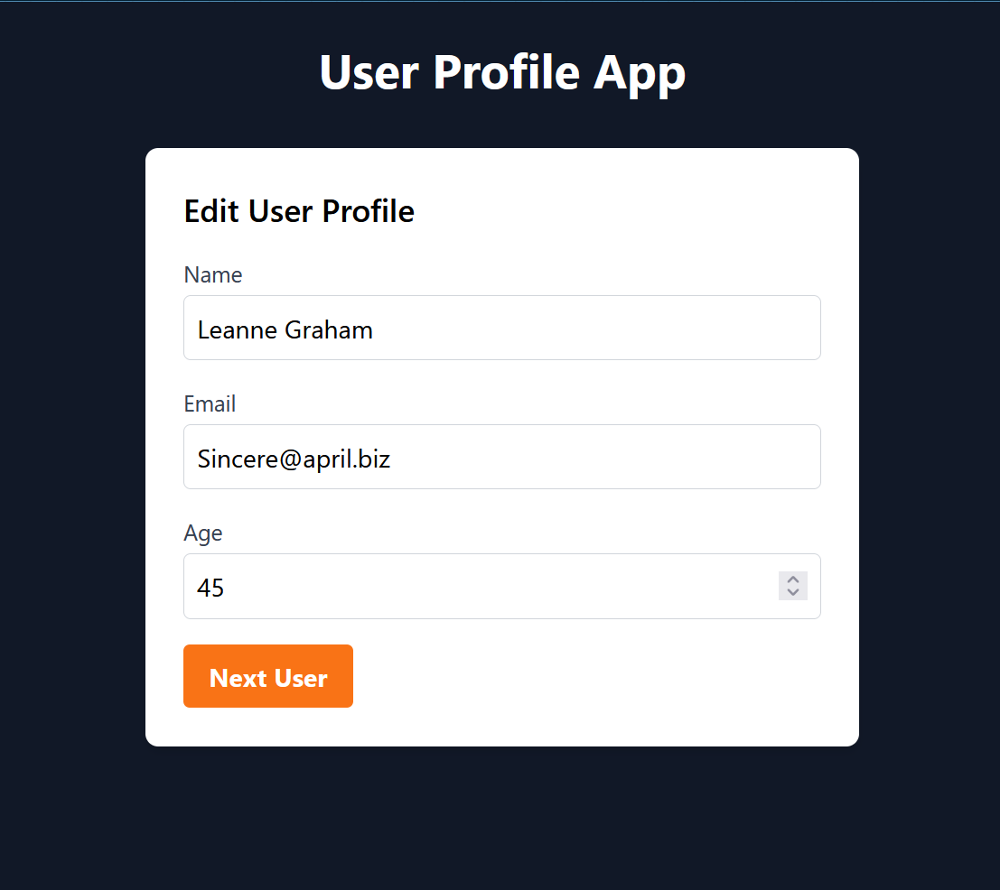

# User Profile App

This is a simple user profile app built with React, TypeScript, and Tailwind CSS. The goal of this project is to help you understand how to update the UI of an app and how to handle external communication of React components.



## Learning Objectives

- Understanding how components communicate with external resources
- Learning the useEffect hook
- Understanding the differences between the useEffect and useState hooks
- Learning how to render JSX conditionally
- Using Typescript to safe guard incoming data

## Features

- Fetch user data from a public API (JSONPlaceholder).
- Display user profile information (name, email, age).
- Load the next user profile after clicking the "Next User" button.
- Reset and start over after viewing 10 users.

## Taking a Look at the Completed Project

To set up the project after forking or downloading it from GitHub, follow these steps:

1. Open with your favorite code editor

2. Install the required dependencies by running the following command:

```
npm install
```

3. Start the development server by running the following command:

```
npm run dev
```

Happy Coding and Learning 😊
